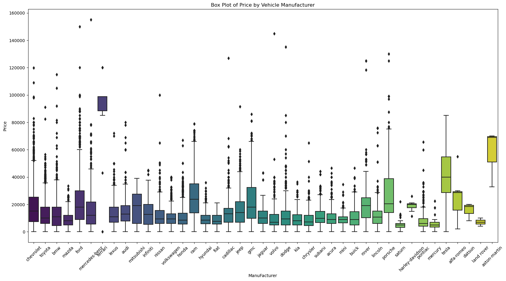
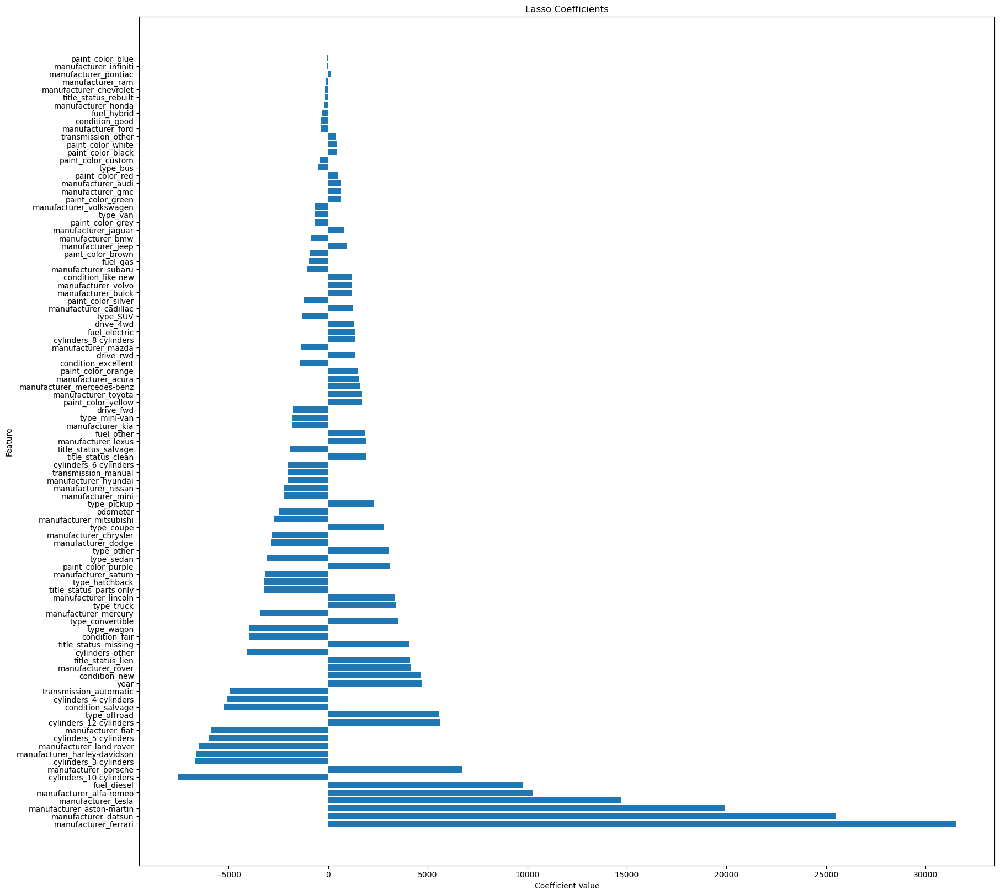

# papp2

## Problem Statement:
what drives a price of a Car?
The goal of this project is to explore used vehicles dataset from Kaggle and understand what factors make a car more or less expensive.  

## Solution submission:
Papp_II.ipynb - Contains the solution sumbission

## Outcomes/Prediction
We are trying to predict impact of different features of car on the Price of the car

Features used for prediciton in this dataset:

categorical_features = [ 'manufacturer', 'condition','fuel', 'title_status', 'transmission', 'drive', 'type', 'paint_color', 'cylinders']
numerical_features = ['year', 'odometer']

Target Feature: Price

### Data Acquisition
Provided vehicles.csv data has 426880 and total of 18 columns.

### Missing Data:
As first step the data was analyzed for missing values and nans. Missing data are summarized below.

id                   0

region               0

price                0

year              1205

manufacturer     17646

model             5277

condition       174104

cylinders       177678

fuel              3013

odometer          4400

title_status      8242

transmission      2556

VIN             161042

drive           130567

size            306361

type             92858

paint_color     130203

state                0

## Data Preparation:

- Removed outliers in the price column
- Dropped columns with more than 30% missing data
- Dropped missing rows, 
- Dropped features with high cardinality
- Invalid price values checked and removed.
- 'VIN', 'region', 'state' columns were dropped as they are not related to feature of a car 
- Encoded categorical features using one-hot encoding.
- Transformed numerical features using mean imputer and standard scaler

## Data Visualization:

#### Box plot of vehicles by manufacturer reviweing one categorical vs conitnuous variable of price
- We can see traditional luxury cars have high price from manufactures of Ferrari, Porsche, Aston-Martin
- Tesla are priced higher over most other manufacturers
- Majority of the vehicles are under 20K

## Analysis and Modeling

- Exploratory Data Analysis (EDA): Analyzed the dataset to understand data distributions, correlations, and relationships between features.

- Machine Learning Models: Linear regression and Lasso regression for predicting vehicle prices using cross validation. Best Lasso model was used for modeling returned by RandomizedSearchCV.

## Model Evaluation: 
 Evaluated model performance using RMSE and R-squared. Looking at RMSE as the unit matches the target price in $ and R-Squared to look at the percentage.
- Linear regression achieved an RMSE of $7881.7 and R-squared of 0.62.
- Lasso regression achieved an MSE of $7881.7 and R-squared of 0.62.

## Findings
* Luxury car manufacturers like Ferrari, Datsun, Aston-Martin have strong influence on vehicle price
* Diesel fuel cars have strong influence over other types
* Year of Manufacture has significant impact on car price 
* Off Road vehicle impact price over other types of vehicles
* Vehicles in like new condition tend to have higher prices compared to fair or other condition.

## Dependencies

The analysis and modeling require following Python libraries:
- pandas
- numpy
- matplotlib
- seaborn
- scikit-learn

## Next Steps:
As per CRISP-DM, the next step would be to deploy the recomendation provided, monitor and fine tune as necessary and use real-world performance feedback to maintain effectiveness over time.